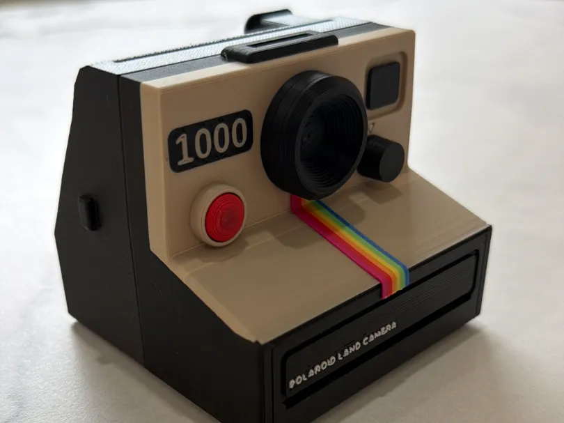

# Parametric Polaroid

A fully parametric Land Camera 1000 / OneStep display model, built in OpenSCAD with Claude. A little piece of instant-camera nostalgia you can resize, customize and print.



[Print profile on MakerWorld](https://makerworld.com/en/models/2984938-polaroid-land-camera-1000-onestep-fully-parametric#profileId-3349375) · [Download the combined STL](models/camera.stl) · [Editable source](camera.scad)

This is a decorative model, not a working camera.

## Customize

Open `camera.scad` in OpenSCAD. All geometry is defined in the source; it has no external mesh imports. Dimensions are in millimetres. Text uses `Liberation Sans:style=Bold`; install that font for consistent lettering.

| Parameter | Meaning |
|---|---|
| `scl` | Overall scale; `1` is the master size |
| `W` | Body width, default 109 mm |
| `show_card` | Show a generic decorative card; disable for camera-only export |
| `squish` | `0` for master proportions, `1` for the desk ornament variant |
| `back_sq` | Rear-body depth multiplier; `1` preserves master proportions |
| `top_slot` | Optional top display-card slot |
| `part` | Select `all`, `black`, `cream`, `red`, `white`, `rainbow`, or `card` |
| `piece` | Select `all`, `face`, or `body` |
| `rb_band` | `-1` for all rainbow bands, or `0` through `5` |

## Render and export

Install OpenSCAD with the Manifold backend and Python 3, then run:

```sh
python3 export.py preview
python3 export.py stl
```

Set `OPENSCAD` to your executable path if it is not on PATH or in the standard macOS application location. Outputs go into `exports/`.

The included STL is a combined geometry export with the preview card disabled. It does not preserve filament assignments. Use the MakerWorld profile for the painted print workflow, and inspect the sliced result before printing at a different scale or with different settings.

The source has been rendered and exported with OpenSCAD's Manifold backend without geometry errors. The photo shows an actual print; it does not establish printability of every parameter combination.

## Reference and license

Created by **Burner Tools**. The model was reconstructed as parametric geometry using the purchased [Polaroid Camera by albaro3d](https://www.cgtrader.com/3d-models/electronics/video/polaroid-b67ed7eb-1a0c-4d1d-b6f6-a9ebf983937b) as a dimensional reference. This repository contains our SCAD reconstruction and exports, not the purchased Blender projects, meshes or textures. The original reference retains its own license.

The material in this repository is licensed under **Creative Commons Attribution-NonCommercial-ShareAlike 4.0 International**, matching the MakerWorld model. See [LICENSE](LICENSE) and the [license summary](https://creativecommons.org/licenses/by-nc-sa/4.0/).

You may share and adapt it for noncommercial purposes with attribution, a license link, and an indication of changes. Shared adaptations must use the same license. Suggested credit:

> Parametric Polaroid by Burner Tools — https://github.com/kellygold/polaroid-parametric — CC BY-NC-SA 4.0. Changes: describe your modifications, if any.

Polaroid names and marks belong to their respective owners. This is an independent project with no affiliation or endorsement.

## Support

If this project is useful to you, you can [support Burner Tools](https://buymeacoffee.com/burnertools)
on Buy Me a Coffee.
